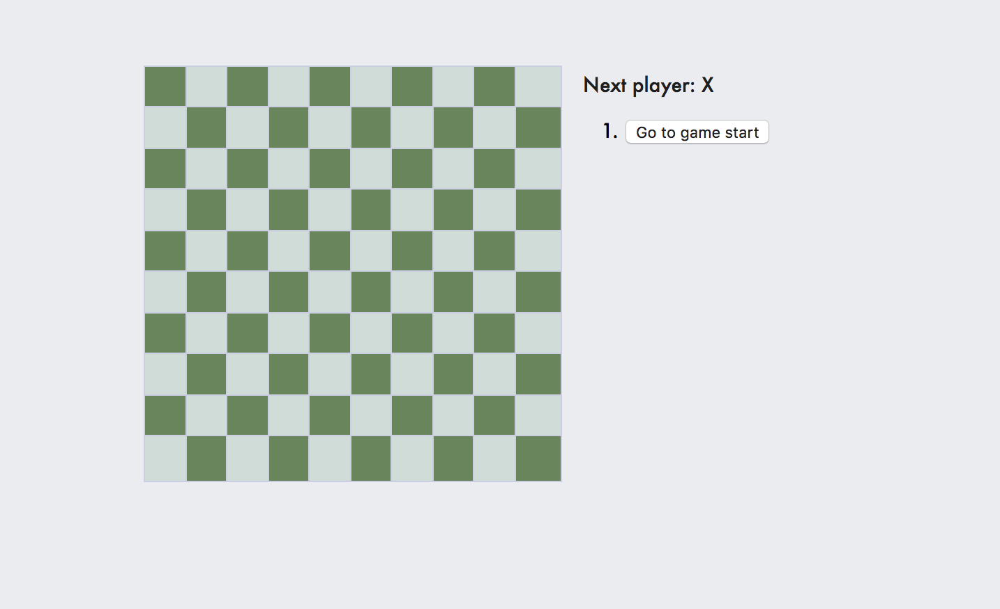

This project was bootstrapped with [Create React App](https://github.com/facebook/create-react-app).

I followed the instruction on this [tutorial](https://reactjs.org/tutorial/tutorial.html). I changed the 3X3 board to 10X10 board and make the winning rule as 5 Xs or Os on the same line. The history is stored and the player can go back to any step.

The board looks like:

## Available Scripts

In the project directory, you can run:

### `npm start`

Runs the app in the development mode. 
Open [http://localhost:3000](http://localhost:3000) to view it in the browser.

The page will reload if you make edits. 
You will also see any lint errors in the console.

### `npm test`

Launches the test runner in the interactive watch mode. 
See the section about [running tests](https://facebook.github.io/create-react-app/docs/running-tests) for more information.
